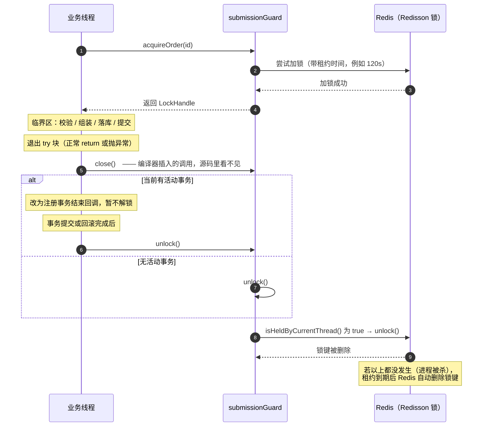

## 第 0 节　先给答案

你看到的这行代码：

```java
try (LockHandle ignored = submissionGuard.acquireOrder(id)) {
    干活();
    return "成功";
}
```

| 你可能想问的 | 答案 |
| --- | --- |
| `close()` 会被调用吗？ | **会**，而且一定会 |
| 谁调用的？ | **编译器 javac** 在编译期把它插进代码里的。不是 Spring，不是 Redisson，不是 JVM 的 GC，也不是某个"框架的魔法" |
| 什么时候调用？ | 退出 `try` 块的那一刻。不管是执行完最后一行、还是执行到 `return`、还是抛出了异常 |
| 凭什么保证？ | 靠两条**编译期**规则：① 语法规定资源的类型必须实现 `AutoCloseable`；② 语法规定编译器必须生成"无论如何都要调用 `close()`"的代码 |
| 什么情况下不会调用？ | 进程被强杀（`kill -9`、断电、被 OOM Killer 干掉）。这时 `finally` 根本来不及跑，只能靠 Redis 的**租约过期**兜底 |
| 我要自己写 `close()` 吗？ | 不要。你写一遍，编译器再写一遍，就变成释放两次 |

把整个流程压缩成一张图：

```
try (资源 = 获取()) { ... }
        │
        ├── 正常执行完 ─┐
        ├── 执行到 return
        └── 抛出异常 ───┤
                        ↓
              close() 一定会被执行
              （编译器把它写在了 finally 里）
                        ↓
            RedissonLockHandle.close()
                        ↓
                   unlock()
                        ↓
              lock.unlock()  →  Redis 里的锁键被删除
```

---

## 第 1 节　迷惑从哪来：一行"看不到解锁"的代码

你看到的方法大概长这样（**你项目里**的 `initiateApproval`）：

```java
public XxxResponse initiateApproval(Request request) {
    Long id = request.getId();

    try (LockHandle ignored = submissionGuard.acquireOrder(id)) {
        // ……一堆校验、组装、落库……
        return submitWithPreRegistration(...);
    } catch (Exception exception) {
        return OaUtils.buildErrorResponse(...);
    }
}
```

把这段代码从上到下读一遍，你会发现一件很别扭的事：

**它加锁了，但翻遍整个方法，找不到任何一处解锁。**

没有 `unlock()`，没有 `release()`，没有 `close()`。括号里那个变量还偏偏叫 `ignored`（被忽略的）。

于是很自然的怀疑出现了：

- 这锁是不是根本没释放？那岂不是每次提交完，接下来的请求全被卡住？
- 或者，是不是 Redisson 有什么"自动解锁"的黑科技？
- 还是说 JVM 发现这个变量没人用了，偷偷帮你调了 `close()`？

**都不是。** 真相是：`close()` 被调用这件事，**在源码层面是被故意藏起来的**——因为编译器会把代码改写成另一副样子，改写后的版本里有明确的 `close()` 调用，位置就在 `finally` 里。

所以这份文档接下来要做的事情只有一件：**把编译器改写的那个版本复原给你看**。看完了，这段代码就不再有任何神秘之处。

---

## 第 2 节　前置概念速通

这一节是给纯新手的。如果你已经熟悉 Java 的接口和异常，可以直接跳到第 3 节。

### 2.1　接口：一份"你必须实现这些方法"的合同

Java 里 `interface` 只规定"有哪些方法"，不规定"方法体怎么写"：

```java
public interface AutoCloseable {
    void close() throws Exception;   // 只有签名，没有方法体
}
```

含义是：**任何自称是 `AutoCloseable` 的类，都必须能响应 `close()` 这个指令**，至于怎么响应（关文件？解锁？什么都不做？）由实现者自己决定。

打个比方：合同上写"乙方须在项目结束时交付结项报告"。合同不关心你写 3 页还是 300 页，但**你必须交**。

### 2.2　多态：调用的写法和实际执行的代码可以不是同一处

```java
LockHandle handle = new RedissonLockHandle(lock, key);
handle.close();          // 这一行调用的是 RedissonLockHandle.close()
```

编译时，编译器只知道"`handle` 是一个 `LockHandle`，它有 `close()`"。
运行时，JVM 才根据 `handle` 真正指向的对象，决定执行哪一份 `close()`。

**这一点在本篇里非常关键**：编译器插入的 `close()` 调用，调用的是**接口方法**；至于这个接口背后坐着的是"真锁"还是"空锁"，编译器根本不关心，也不需要关心。

### 2.3　finally：无论如何都要执行的收尾区

```java
try {
    System.out.println("干活");
    return "成功";
} finally {
    System.out.println("收尾");
}
```

执行结果是先打印"干活"，再打印"收尾"，最后才返回"成功"。

`finally` 的语义用一句话概括：**只要程序执行进了 `try` 块，那么无论 `try` 块里是正常跑完、还是 `return`、还是抛出异常，`finally` 都会被执行。**

这不是"一般情况下会"或者"大多数时候会"，而是语言规范级别的保证。JVM 实现 `finally` 的方式是记录"这段代码的异常处理目标"，所以连抛异常这种控制流跳转都绕不过它。

唯一的例外是 JVM 整个进程直接消失（断电、`kill -9`）——那时候已经没有任何代码有机会运行了。

### 2.4　受检异常：为什么 `throws Exception` 很烦人

Java 把异常分成两类：

- **受检异常（checked）**：编译器强制你处理。典型代表就是 `Exception` 本身。你不 `catch` 也不 `throws`，代码编译不过。
- **非受检异常（unchecked）**：`RuntimeException` 及其子类（`NullPointerException`、`IllegalStateException` ……）。编译器不管你。

`AutoCloseable.close()` 的签名是 `void close() throws Exception;`——**它声明了一个受检异常**。这意味着任何直接拿 `AutoCloseable` 当资源类型的代码，都会被编译器要求"处理 `Exception`"。

这个麻烦是第 4 节的主角：`LockHandle` 存在的全部意义，就是为了把这个麻烦消掉。

### 2.5　lambda 与 `@FunctionalInterface`

如果一个接口**有且只有一个抽象方法**，那它就可以用 lambda 表达式来写实现：

```java
// 完整写法：匿名内部类
LockHandle noOp = new LockHandle() {
    @Override
    public void close() {
        // 什么都做
    }
};

// 简写：lambda
LockHandle noOp = () -> { };
```

这两段代码在运行时的行为**完全等价**。`() -> { }` 里的 `()` 表示"`close()` 没有参数"，`{ }` 是空的实现体。

`@FunctionalInterface` 这个注解的作用是**让编译器帮你检查**："这个接口确实只有一个抽象方法"。如果你不小心加了第二个方法，编译会直接报错，而不是等到有人写 lambda 时才发现写不了。

---

## 第 3 节　核心机制：try-with-resources 是编译器在改你的代码

### 3.1　先说它为什么被发明出来

try-with-resources 是 **Java 7** 引入的语法（属于当年的 Project Coin 语言改进计划），和 Spring、Redisson 一点关系都没有。它要解决的问题是：**手动写释放代码，总会有人漏掉。**

Java 7 之前，大家只能手写：

```java
LockHandle handle = acquire();       // 先获取
try {
    干活();
} finally {
    handle.close();                  // 再确保释放
}
```

这段代码看起来没问题，但现实中它会以三种方式失效：

**失效方式一：漏写 `finally`。**

```java
LockHandle handle = acquire();
try {
    干活();
} catch (Exception e) {              // 只写了 catch，忘了 finally
    log.error("失败了", e);
}
// handle 从来没被释放 → 锁泄漏
```

**失效方式二：代码路径绕过释放。** 后来有人加了提前返回：

```java
LockHandle handle = acquire();
try {
    if (参数不合法) {
        return error();              // 新增的提前返回
    }
    干活();
} finally {
    handle.close();
}
```

这个还好，因为有 `finally` 保护。但如果有人把 `acquire()` 挪进了 `try` 块里面，或者把 `close()` 从 `finally` 里挪了出来，保护就消失了——而这类改动往往发生在"修一个不相关的 bug"的时候。

**失效方式三：获取成功之后、进入 `try` 之前出错。**

```java
LockHandle handle = acquire();           // 锁已经拿到了
validateSomething();                     // 这里抛异常 → 后面的 try 根本没进
try {
    干活();
} finally {
    handle.close();                      // 永远不会执行 → 锁泄漏
}
```

**为什么这类 bug 特别难查？** 因为它不会当场报错。程序跑得好好的，只是"锁慢慢泄漏了"。你半个月后看到的现象是：某个功能提交一次之后就一直转圈超时、连接池被打满。而你要从"超时"倒推回"半个月前某处少写了一个 finally"，中间隔着十万八千里。

try-with-resources 的设计目标就是把这件事**从"靠人记得写"变成"编译器强制写"**：资源的获取和释放这两件事被绑在同一个语法结构里，你获取了，就必然被释放，中间没有插错代码的缝隙。

### 3.2　第一条规则：括号里的东西必须实现 `AutoCloseable`

这是编译期的类型检查，不是运行时检查。你往括号里放一个普通类试试：

```java
public class NotCloseable {
    static class Foo {}                      // 一个什么都没实现的普通类

    static void t() {
        try (Foo f = new Foo()) {
            System.out.println(f);
        }
    }
}
```

javac 的真实输出（英文环境）：

```
NotCloseable.java:5: error: incompatible types: try-with-resources not applicable to variable type
        try (Foo f = new Foo()) {
                 ^
    (Foo cannot be converted to AutoCloseable)
1 error
```

中文环境下的同一条报错：

```
错误: 不兼容的类型: try-with-resources 不适用于变量类型
    (Foo无法转换为AutoCloseable)
```

**编译器为什么非要检查这一条？** 因为它的改写方案里需要生成一行 `f.close()`。如果 `Foo` 根本没有 `close()` 方法，这行代码就生成不出来。与其在生成阶段失败，不如在类型检查阶段就拦住你。

于是逻辑闭环了：

1. 编译器检查类型 → 确认它一定有 `close()` 方法；
2. 编译器确认之后 → 放心地插入 `close()` 调用。

**整件事完全发生在编译期，不涉及运行时反射，也不涉及任何"猜测"。** 这也是为什么你翻运行时的调用栈，看不到任何"框架在帮你调 close"——调用栈里只有你自己的代码和一个 `close()` 帧。

### 3.3　第二条规则：`close()` 被写进 `finally`

现在来还原编译器改写的版本。你写的：

```java
try (LockHandle ignored = submissionGuard.acquireOrder(id)) {
    干活();
    return "成功";
} catch (Exception e) {
    return "失败";
}
```

**编译器眼中的等价代码**（注意：这是概念上的等价改写，javac 并不会真的生成一个 `.java` 文件再编译它，它是直接生成字节码的）：

```java
// ===== 编译器眼中的等价代码 =====
LockHandle ignored;
try {                                                    // ⑤ 外层 try：为了接住你写的 catch
    ignored = submissionGuard.acquireOrder(id);          // ① 资源初始化
    Throwable 主异常 = null;                              // ② 用来记录 try 块里抛出的异常
    try {
        干活();
        return "成功";                                    // ③ 正常路径
    } catch (Throwable t) {                              // ④ 抓住一切（注意不是 Exception）
        主异常 = t;
        throw t;                                         //    先记下来，再继续往外抛
    } finally {
        if (ignored != null) {                           // ⑥ 初始化成功，才有东西可关
            if (主异常 != null) {                         // ⑦ 已经有主异常了
                try { ignored.close(); }
                catch (Throwable 关闭异常) {
                    主异常.addSuppressed(关闭异常);        //    把关闭异常"挂"在主异常身上
                }
            } else {
                ignored.close();                         // ⑧ 没有主异常 → 正常关闭
            }
        }
    }
} catch (Exception e) {
    return "失败";
}
```

逐条解释这八处改写：

**① 资源初始化被提到了 `try` 之前。**
编译器不会让 `acquireOrder(id)` 执行多次，也不会把它放进被保护的代码块里。这个位置很关键，它决定了"初始化失败会不会触发 `close()`"——答案是不会，因为那时还没有成功的资源可关（实测见 3.4 场景 4）。

**②③④ 用一个 `Throwable` 变量把异常抄一份下来。**
第 ④ 步的 `catch (Throwable t)` 之所以抓 `Throwable` 而不是 `Exception`，是因为**连 `Error` 都要触发释放**。比如你写了死递归导致 `StackOverflowError`，钩子仍然要跑，锁仍然要放。

**⑤ 你写的 `catch` 被放到了外层。**
这一层很容易被忽略，但它有个实实在在的后果：**它连"资源初始化时抛出的异常"也能接住**。（下面 3.4 的场景 4 实测验证了这一点。）

**⑥ `if (ignored != null)` 这个判空不是多余的。**
因为资源表达式完全可以返回 null（例如「Redis 挂了就返回一个不做事的对象」这种设计，或者干脆写 `try (Foo f = null)`），编译器必须保证这种情况不抛 NPE。实测见 3.4 场景 7。

**⑦⑧ `finally` 是整件事的心脏。**
`close()` 就写在这里。`finally` 的语义是"无论如何都执行"，所以 `close()` 也被"无论如何都执行"了。**它不是系统智能地猜到了你该解锁，而是编译器明文写死在 `finally` 里的。**

**⑦ 里的 `addSuppressed` 是什么？**
考虑一种情况：`try` 块里抛了"业务异常"，而在 `finally` 里关资源时又抛了"关闭异常"。两份异常，只能有一个被扔出去，怎么办？

- **错误做法**：让关闭异常覆盖业务异常。结果是控制台只显示"关闭失败"，而真正的病根（业务异常）被抹掉了。排查问题的人会被带到完全错误的方向。
- **Java 的做法**：业务异常照常抛出，关闭异常通过 `addSuppressed()` **附加**在它身上。

抛出后的样子长这样：

```
Exception in thread "main" java.lang.IllegalStateException: 业务异常
	at ...
	Suppressed: java.lang.IllegalStateException: 关闭失败
		at ...
```

在代码里读出来是：

```java
catch (Exception e) {
    e.getMessage();               // "业务异常"        ← 主异常还在
    e.getSuppressed();            // [关闭失败的那个]   ← 附加上去的一个
}
```

**日常理解可以把这段忽略**：只要记住"异常不会被吞掉，也不会互相覆盖"就够了。

### 3.4　实测：七个场景的真实输出

光看改写后的代码不够直观，下面这段程序在 JDK 17 上真跑过（完整代码见附录）。输出是**原样复制**的。

**场景 1：正常 `return`**

```java
static String normal() {
    try (Res r = new Res("A")) {
        System.out.println("  [body]    干活，准备 return");
        return "成功";
    }
}
```

```
== 场景1: 正常 return ==
  [acquire] A
  [body]    干活，准备 return
  [close]   A
normal() 返回值 -> 成功
```

注意顺序：`[close] A` 出现在 `normal() 返回值` **之前**。这说明 `close()` 不仅执行了，而且是在方法把控制权交还给调用方之前就执行完了。**先解锁，才返回。**

**场景 2：`try` 块里抛异常**

```
== 场景2: try 块里抛异常 ==
  [acquire] B
  [body]    干活，抛异常
  [close]   B
bodyThrows() 返回值 -> catch 到: 业务异常, suppressed=0
```

`close` 照样执行，并且没有产生 suppressed 异常（因为关闭本身没出错，`suppressed=0`）。

**场景 3：业务异常和关闭异常同时发生**

```
== 场景3: 业务异常 + 关闭也抛异常 ==
  [acquire] C
  [close]   C
bothThrow() 返回值 -> catch 到: 业务异常 | suppressed: 关闭失败:C
```

`catch` 拿到的是**业务异常**（原始的病根没丢），关闭异常挂在 `suppressed` 里。这就是 3.3 第 ⑦ 点的实际效果。

**场景 4：资源初始化就失败**

```
== 场景4: 资源初始化就抛异常 ==
initFails() 返回值 -> catch 到初始化异常: 初始化就失败了
```

两个结论：

- 你写的 `catch (Exception e)` **确实能接住初始化异常**（因为编译器在外层又包了一个 `try`，见 3.3 第 ⑤ 点）；
- 但 `[close] BadInit 被调用了` 这行**没有出现**——初始化失败的资源不会被关闭（因为压根没建立起来）。

**场景 5：一个 `try` 里放两个资源**

```
== 场景5: 两个资源的关闭顺序 ==
  [acquire] 1
  [acquire] 2
  [body]    两个资源都活着
  [close]   2
  [close]   1
```

获取顺序是 1、2，**关闭顺序是 2、1**——倒过来，像叠盘子一样，后放上去的先拿下来。这是规范规定好的行为。

**场景 5 的补充：后一个资源初始化就失败时，前一个会被关掉吗？**

```java
try (LockHandle a = acquire("1"); LockHandle b = boom()) {   // boom() 直接抛异常
    System.out.println("  [body]    到不了这里");
} catch (Exception e) {
    System.out.println("  catch: " + e.getMessage());
}
```

```
  [acquire] 1
  [close]   1
  catch: 第二个资源初始化失败
```

**会。** 已经成功获取的资源（1）会被正确关闭，正在获取的那个（2）因为没建立起来，不会被关。这一点不需要你写任何额外代码——编译器生成的多层嵌套结构天然就有这个效果。

**场景 6：`try` 里 `return`「成功」，但 `close()` 抛异常**

```java
static String bodyOkButCloseThrows() {
    try (LockHandle x = closingThrows()) {
        System.out.println("  [body]    准备 return 成功");
        return "成功";                      // 已经算好了要返回"成功"
    } catch (Exception e) {
        return "被 catch 接住 -> " + e.getMessage();
    }
}
```

```
== A: try 里 return，close 又抛异常（有 catch） ==
  [body]    准备 return 成功
  [close]   关闭时抛异常
返回值 -> 被 catch 接住 -> 关闭失败
```

**那句 `return "成功"` 白写了。** 因为在 3.3 的改写里，`close()` 是在 `finally` 里执行的，而 `finally` 里的异常会让整个方法以异常结束——你要返回的值被丢弃了。

如果外层没有 `catch`（`close()` 抛的是 `RuntimeException`，不需要声明），异常就一路传到调用方：

```
== B: 没写 catch（有 catch 没写 throws） ==
  [close]   关闭时抛异常
调用方拿到异常 -> IllegalStateException: 关闭失败  （那句 return "成功" 白写了）
```

**这个坑很重要**：它意味着"关闭资源时的失败"有可能把一个本来成功的业务请求变成失败。后面第 5 节你会看到，`RedissonLockHandle` 是怎么用 `try/catch` 把这个问题有意按住的。

**场景 7：资源是 null**

```
== 资源是 null ==
  [body]    ignored 是 null，也能进 try
  没有 NPE，因为编译器生成了 if (n != null) 判断
```

`try (LockHandle n = null) { ... }` 是合法的，也不会抛 NPE——正是 3.3 第 ⑥ 点那个判空在起作用。

### 3.5　扒开看字节码：`close()` 真的写在里面

上面都是"概念上的等价代码"。如果你怀疑这只是比喻，可以直接反汇编看 JVM 指令。

源码（一个最小化的例子）：

```java
public class Sugar {
    interface LockHandle extends AutoCloseable {
        @Override void close();
    }

    static String run(LockHandle handle) {
        try (LockHandle ignored = handle) {
            return "成功";
        } catch (Exception e) {
            return "失败";
        }
    }
}
```

编译并反汇编：

```bash
javac -g Sugar.java
javap -c -p Sugar
```

**真实输出**（右边注释是我加的）：

```
static java.lang.String run(Sugar$LockHandle);
  Code:
     0: aload_0                                 // 加载参数 handle
     1: astore_1                                // 存进局部变量 1 —— 这就是 ignored
     2: ldc           "成功"                     // 先把要返回的值准备好
     4: astore_2                                // 暂存到局部变量 2
     5: aload_1
     6: ifnull        15                        // if (ignored == null) 就跳过 close
     9: aload_1
    10: invokeinterface LockHandle.close:()V     // ★ 正常路径：close() 就在这里
    15: aload_2
    16: areturn                                 // 真正返回
    17: astore_2                                // ↓ 异常路径：主异常存下来
    18: aload_1
    19: ifnull        37
    22: aload_1
    23: invokeinterface LockHandle.close:()V     // ★ 异常路径：close() 又在这里
    28: goto          37
    31: astore_3                                // 关闭时自己抛出的异常
    32: aload_2
    33: aload_3
    34: invokevirtual Throwable.addSuppressed    // 主异常.addSuppressed(关闭异常)
    37: aload_2
    38: athrow                                  // 把主异常抛出去
    39: astore_1                                // 你写的 catch (Exception e) 从这里开始
    40: ldc           "失败"
    42: areturn

Exception table:
   from    to  target type
       2     5    17   Class java/lang/Throwable
      22    28    31   Class java/lang/Throwable
       0    15    39   Class java/lang/Exception
      17    39    39   Class java/lang/Exception
```

**怎么读这段输出？** 挑四条最关键的：

**（1）第 1 行 `astore_1` 位于异常保护范围之外。**
异常表里 `from 2` 意味着保护从偏移量 2 才开始，而资源初始化发生在偏移量 1。所以"初始化失败的资源不会被关闭"在字节码层面是字面事实。

**（2）有两处 `invokeinterface ... close:()V`（偏移 10 和 23）。**
一处负责正常退出，一处负责异常退出。**字节码里没有那个"主异常"布尔变量**——javac 用的是更直接的办法：把 `close()` 复制成两份，再配两张异常表条目。效果和 3.3 里写的概念版本一致，但实现形式不同。这就是为什么我说 3.3 只是"概念上的等价改写"。

**（3）`invokevirtual Throwable.addSuppressed` 明晃晃地出现在指令里。**
异常抑制不是玄学，就是一次普通的虚方法调用。

**（4）异常表第一行的 `type` 是 `Class java/lang/Throwable`，范围是 `from 2 to 5`。**
这一行就是 `finally` 的机器表示：它等价于"这一段代码里，无论抛出什么（`Throwable`，即 any），都跳到偏移量 17 去处理"。所谓"`finally` 一定执行"，落到机器层面就是这个异常表条目。

**顺带一个细节**：异常表第三行从 `0` 开始，也就是**连资源初始化（偏移 0~1）都被你写的 `catch (Exception e)` 覆盖着**。这正好印证了 3.4 场景 4 的实测结果。

### 3.6　排除法：功劳不属于这些东西

新手很容易把这件事归因到错误的对象上，一并说清楚：

| 候选"功臣" | 是不是它干的 | 说明 |
| --- | --- | --- |
| **javac（编译器）** | ✅ **是它** | 在编译期插入 `close()` 调用、构建异常表 |
| Spring | ❌ | Spring 的 AOP、`@Transactional`、`@PreDestroy` 与这行代码无关 |
| Redisson | ❌ | Redisson 只提供 `RLock` 这个"锁"的实现，它不知道什么叫 try-with-resources |
| JVM / 垃圾回收 | ❌ | GC 回收的是**内存**，不是**锁**。一个 `LockHandle` 对象被回收，不代表 Redis 里的锁键被删除 |
| `finalize()` / 虚引用清理 | ❌ | 这是"不确定什么时候执行"的机制，不能用来保证释放锁 |
| 运行时反射 / 字节码增强 | ❌ | 没有任何运行时查找 `close` 方法的过程，编译期就写死了 |

一句话：**这是一个语言语法特性，只有编译器参与。**

### 3.7　四种自己动手验证的办法

想亲自确认的话，下面四种任选：

**办法一：打日志。** 在资源和 `close()` 里各打一行日志，就是本文附录 Demo 的做法。最直观，新建项目零成本。

**办法二：反汇编。** `javac -g X.java && javap -c -p X`，看 3.5 那四条特征（两处 close 调用、`addSuppressed`、`Throwable` 类型的异常表条目）。

**办法三：在 `close()` 里打断点，看调用栈。** 这招对"到底是谁调用了 close"这个疑问最有说服力。你会看到调用栈大致是：

```
close()                          ← 栈顶：你自己的 close 实现
run() / initiateApproval()       ← 你的业务方法
main()                           ← 调用方
```

**栈里没有 Spring，没有 Redisson，没有任何框架的中间层。** 因为调用它的代码就在你的方法体里（编译器插入的那几行），只不过你看不见它们。

**办法四（图省事）：用 IDEA 反编译。** 打开编译产物（`build/classes` 下的 `.class`），IDEA 会自动反编译成 Java 代码，你会看到和 3.3 非常接近的样子。

### 3.8　新手容易踩的坑（本节全部经实测确认）

**坑 1：把资源写在 `try` 块第一行——看起来一样，其实完全不一样。**

```java
// ❌ 这是错的，锁会泄漏
try {
    LockHandle ignored = submissionGuard.acquireOrder(id);   // 只是个普通局部变量
    干活();
} catch (Exception e) {
    return OaUtils.buildErrorResponse(e);
}
// 没有 finally，锁永远不会被主动释放
```

这个写法和正确的写法长得非常像，但**语法上它压根不是 try-with-resources**：`try {` 后面直接跟 `{`，括号里什么都没有。资源必须写在 `try` 后面的**圆括号**里，这才是"注册为资源"这个动作。

后果很具体：锁不释放 → 只能等租约（比如 120 秒）自动过期 → 用户提交一次之后，两分钟内提交不了第二次，还以为系统卡死了。

**坑 2：资源变量是隐式 `final` 的，不能在块里重新赋值。**

```
error: auto-closeable resource x may not be assigned
            x = null;
            ^
```

**坑 3：只写 `try` 不写 `catch`/`finally` 是合法的。**
普通 `try` 必须搭配 `catch` 或 `finally`，但 try-with-resources 可以单独存在：

```java
try (LockHandle ignored = acquire()) {
    干活();
}                       // 这样写完全合法，不需要 catch
```

因为括号里已经隐含了"一定会执行收尾动作"的保证。

**坑 4：Java 9 起可以直接用已有的变量。**

```java
LockHandle h = submissionGuard.acquireOrder(id);
try (h) {                              // Java 9+ 才支持这种写法
    干活();
}
```

变量必须是 `final` 或"事实上不会被再赋值"（effectively final）。**看到别人这样写不要惊讶**，它是同一件事的另一种写法，反编译后的字节码是一样的。

**坑 5：别手动再调一次 `close()`。**
编译器已经调了一次，你再写一次就是释放两次。`RedissonLockHandle` 里因为做了 `isHeldByCurrentThread()` 判断，重复调用相对安全，但这是它自己做的额外防护，不是 try-with-resources 的承诺——换成别的资源类型（比如文件流），重复关闭的行为就要看具体实现了。

---

## 第 4 节　既然有 `AutoCloseable`，为什么还要自己定义 `LockHandle`

这是很多人第一次读到这段代码时最真实的疑问：`AutoCloseable` 已经能满足 try-with-resources 的要求了，为什么还要多定义一个接口？

```java
@FunctionalInterface
public interface LockHandle extends AutoCloseable {
    @Override
    void close();
}
```

答案就藏在 `@Override void close();` 这一行的**没有 `throws`** 里。

### 4.1　先看清 `AutoCloseable` 和 `Closeable` 的关系

| | `AutoCloseable` | `Closeable` | `LockHandle`（**你项目里**） |
| --- | --- | --- | --- |
| 所在包 | `java.lang` | `java.io` | 你项目自己的包 |
| 出现版本 | Java 7 | Java 5 | — |
| `close()` 声明 | `void close() throws Exception` | `void close() throws IOException` | `void close()`（不抛） |
| 能不能直接当资源用 | 能 | 能 | 能 |
| 用它当资源类型的代价 | 每次都得处理 `Exception` | 每次都得处理 IO 异常 | 什么都不用处理 |

`Closeable` 其实就是 Java 5 时代干过同一件事的老前辈：它继承自 `AutoCloseable`，但把 `close()` 声明的异常从 `Exception` **收窄**成了更具体的 `IOException`。

`LockHandle` 用的是同一个套路，只是收窄得更彻底——**直接收窄到不抛受检异常**。

### 4.2　"收窄异常"是 Java 的一条现成规则

Java 的规则是：**子类型重写方法时，可以声明比父类型更少（或更具体）的受检异常，但不能更多。**

```java
public interface AutoCloseable {
    void close() throws Exception;      // 父接口：声明了受检异常 Exception
}

public interface LockHandle extends AutoCloseable {
    @Override void close();             // 子接口：什么都不声明 → 收窄了
}
```

这个收窄带来的效果，用实测的编译器报错最能说明问题。看下面两段代码，一段用 `AutoCloseable`，一段用 `LockHandle`：

```java
static void useLockHandle(LockHandle h) {
    try (LockHandle ignored = h) {
        System.out.println("不需要 catch，也不需要 throws");     // ✅ 编译通过
    }
}

static void useAutoCloseable(AutoCloseable a) {
    try (AutoCloseable ignored = a) {
        System.out.println("这行编译不过");                      // ❌ 编译报错
    }
}
```

javac 的真实输出（英文环境）：

```
NarrowThrows.java:16: error: unreported exception Exception; must be caught or declared to be thrown
        try (AutoCloseable ignored = a) {
                           ^
  exception thrown from implicit call to close() on resource variable 'ignored'
```

中文环境：

```
错误: 未报告的异常错误Exception; 必须对其进行捕获或声明以便抛出
对资源变量 'ignored' 隐式调用 close() 时抛出了异常错误
```

请仔细看这行报错的措辞：**"对资源变量 `ignored` 隐式调用 close() 时抛出了异常错误"**（`exception thrown from implicit call to close() on resource variable 'ignored'`）。

编译器在这里**亲口承认**了两件事：

1. 它会对资源变量**隐式调用 `close()`**——"隐式"就是"你在源码里看不见"；
2. 这个调用会带来受检异常，所以你得处理。

所以 `LockHandle` 的意义就一句话：**把第 2 条消掉，让调用方只管写业务代码。**

```java
// 有 LockHandle 之后，调用方可以干净成这样：
try (LockHandle ignored = submissionGuard.acquireOrder(id)) {
    return submitWithPreRegistration(...);
} catch (Exception exception) {
    return OaUtils.buildErrorResponse(exception);
}
// 这里 catch 接的是业务异常，不是被 close() 逼着写的
```

### 4.3　`@FunctionalInterface` 是为了让"空锁"能被写成一行

`LockHandle` 上标了 `@FunctionalInterface`，表示"这个接口只有一个抽象方法"。**好处是它能用 lambda 来写实现**——这就是第 5 节里 `NO_OP_LOCK = () -> { }` 能成立的原因。

一个小提醒：`LockHandle` 虽然继承了 `AutoCloseable`（那里也有一个抽象方法 `close`），但因为它把 `close()` **重写**了一遍，所以抽象方法总数**仍然是 1 个**，符合函数式接口的要求。

### 4.4　一句话总结

**`LockHandle` 本身不含任何锁逻辑**，它只是一个"适配层"：

- `extends AutoCloseable` → 让自己**有资格**放进 try-with-resources 的括号里；
- `@Override void close();`（不声明异常） → 让调用方**不必**被强制的 `catch` 污染代码；
- （可选）`@FunctionalInterface` → 让空实现能写成 lambda。

真正的锁逻辑在它的实现类里——见下一节。

---

## 第 5 节　锁的两种实现：真锁与空锁

`acquireOrder(id)` 返回的 `LockHandle`，实际可能是两种东西之一。调用方完全感知不到差别，这正是它设计得好的地方。

### 5.1　真锁：`RedissonLockHandle`

（以下为**你项目里**的实现，我按你贴出的片段整理，重点讲"为什么这样写"。）

```java
private static final class RedissonLockHandle implements LockHandle {
    private final RLock lock;
    private final String lockKey;

    @Override
    public void close() {
        if (TransactionSynchronizationManager.isActualTransactionActive() && ...) {
            // 分支一：当前有活动事务 → 不立刻解锁，注册一个"事务结束后执行"的回调
            TransactionSynchronizationManager.registerSynchronization(...);
            return;
        }
        // 分支二：没有事务 → 立刻解锁
        unlock();
    }

    private void unlock() {
        try {
            if (lock.isHeldByCurrentThread()) {
                lock.unlock();                    // 真正解锁：Redis 里的锁键被删除
            }
        } catch (RuntimeException e) {
            log.error("OA Redis锁释放失败，将等待租约过期，lockKey={}", lockKey, e);
        }
    }
}
```

它确实实现了 `close()`（作为 `LockHandle` 的实现类，不实现就编译不过），而 `close()` 最终走到 `lock.unlock()`。完整调用链：

```
退出 try 块
  └─ 编译器插入的 ignored.close()
       └─ RedissonLockHandle.close()
            ├─ 有活动事务 → 注册事务同步回调，稍后解锁
            └─ 无活动事务 → unlock()
                 └─ lock.isHeldByCurrentThread() 为 true
                      └─ lock.unlock()          ← Redisson 真的把锁从 Redis 里删掉
```

下面拆开讲三处关键设计。

**（一）为什么有事务时要"推迟解锁"？**

锁保护的是"防止重复提交"这段临界区。但如果这段临界区里的数据库写操作还在**未提交的事务**里，此刻就解锁会怎样？

另一个线程立刻拿到锁，进来查库——它看到的是**事务提交之前的数据**（旧数据）。它检查"这个单子还没提交过"，通过；然后它也提交一次。结果就是：**锁正常工作了，但重复提交还是发生了。**

所以正确的做法是：把解锁这个动作，推迟到事务真正结束（提交或回滚完成）之后。Spring 提供了现成的机制——`TransactionSynchronizationManager.registerSynchronization` 注册一个回调，等事务结束由 Spring 来调用它。

这里有一个**隐含前提**必须成立：Redisson 的锁要求"谁加锁、谁解锁"（后面的 `isHeldByCurrentThread()` 就是在检查这一点），所以执行回调的线程必须还是原来那个线程。Spring 的事务结束回调是在事务所属线程上执行的，通常满足这个前提。

> 具体那个 `if` 的判断条件（`...` 部分）请以你项目源码为准；上面解释的是这个分支**为什么必须存在**。

**（二）`isHeldByCurrentThread()` 这个判断在防什么？**

它防两种尴尬：

1. **锁早就自动过期了。** 业务卡了太久（超过租约时间），Redis 已经把锁删了。这时候你再去 `unlock()`，Redisson 会认为"你根本没持有锁，解锁是非法的"，抛 `IllegalMonitorStateException`。
2. **线程对不上。** 在一个不是加锁线程的线程里解锁（Redisson 的 `RLock` 默认不支持跨线程解锁）。

加这个判断的代价是**多一次 Redis 往返**（它是个网络调用，不是本地标志位）。而且严格来说它和后面的 `unlock()` 之间存在极小的竞态窗口——但即使真的撞上了，也还有下面的 `catch` 兜着。

**（三）为什么 `catch (RuntimeException)` 之后只是打个日志，就把异常吞了？**

这是**有意的设计取舍**，两个理由：

**理由一：`close()` 是在"释放阶段"执行的，这时候让异常抛出去，会伤到已经成功的业务请求。** 回看 3.4 场景 6 的实测结论：`try` 里 `return "成功"`，但 `close()` 抛异常，那句 `return "成功"` 就白写了，调用方拿到的是失败。对一个"提交审批"的接口来说，业务数据可能已经落库了，却因为解锁失败给用户报错——这显然更糟。

**理由二：不解锁的后果是可控的。** 查看日志那句话："将等待租约过期"。Redis 会在租约时间（比如 120 秒）到期后自动删除这个锁键。也就是说，**最坏的结果是"这段时间内其他请求拿不到锁、提交不了"，而不是"锁永久泄漏"。**

所以这里的策略是：**宁可让锁多活一会儿，也不让业务请求失败。** 这个判断成立的前提是租约机制存在——这也是为什么获取锁的时候一定要显式传租约时间。

> 注意区分两种"释放失败"的后果：
> - 这里讨论的是 **Redis 正常、但当前线程释放动作失败**（比如锁已过期、线程不匹配）→ 抛异常 → 被 catch → 靠租约。
> - 如果是 **Redis 整个挂掉**：那么 `unlock()` 本身就不可用了，此时释放这件事无论如何都做不到，同样只能靠租约机制（以及 Redis 恢复后的过期清理）。

### 5.2　空锁：`NO_OP_LOCK`

```java
private static final LockHandle NO_OP_LOCK = () -> {
};
```

这是 `LockHandle` 是函数式接口带来的简写。它**完全等价于**：

```java
private static final LockHandle NO_OP_LOCK = new LockHandle() {
    @Override
    public void close() {
        // 什么都不做
    }
};
```

**它在什么时候被返回？** 当 Redis 不可用、加锁这件事根本做不到的时候，`acquireOrder` 不去抛异常打断业务，而是返回它，让流程继续往下走。

**这样做的好处：调用方的代码一行都不用改。**

```java
// 不管是真锁还是空锁，调用方都是这一句
try (LockHandle ignored = submissionGuard.acquireOrder(id)) {
    干活();
}
```

不需要写 `if (是不是真锁)` 这种分支，也不需要两套代码路径。这种"用一个什么都不做的对象，替代"没有对象"的情况"的写法，在软件设计里叫 **空对象模式（Null Object Pattern）**。它和注解 `@FunctionalInterface` 配合得刚刚好：一个空实现的锁，在源码里就是 `() -> { }`。

**但要清醒地看到它的代价：返回空锁意味着"互斥保护消失了"。**

这时候两个线程可以同时进入临界区，`submissionGuard` 这个名字所承诺的"防重复提交"**完全失效**。所以这是一个**业务降级决策**，不是免费的午餐：

- 如果锁只是"防用户手抖重复点提交"，降级通常可以接受——数据库的唯一索引还能做最后一道防线；
- 如果锁保护的是"资金扣减必须串行"这类硬约束，那"Redis 挂了就当没锁"就是个必须重新评估的决策。

**这是读这段代码时唯一需要你带着怀疑眼光看的地方**：不是技术问题，而是业务取舍问题。

### 5.3　两种实现对调用方完全透明

| | 正常情况 | Redis 不可用时 |
| --- | --- | --- |
| `acquireOrder(id)` 返回 | `RedissonLockHandle` | `NO_OP_LOCK` |
| `close()` 的行为 | 注册事务回调，或立刻 `unlock()` | 什么都不做 |
| 互斥保护 | 有 | **没有** |
| 调用方需要写的代码 | `try (LockHandle ignored = ...) { ... }` | **一模一样** |

**这个设计最聪明的地方就在这里**：把"锁是不是真的存在"这件事，完整地关在了 `acquireOrder` 和 `close()` 里面。业务代码自始至终只认识一个 `LockHandle`。

---

## 第 6 节　回到 `initiateApproval`：把整条链路串起来

现在你有全部零件了，可以完整地读这段代码：

```java
public XxxResponse initiateApproval(Request request) {
    Long id = request.getId();

    try (LockHandle ignored = submissionGuard.acquireOrder(id)) {
        // ……校验、组装、落库……
        return submitWithPreRegistration(...);
    } catch (Exception exception) {
        return OaUtils.buildErrorResponse(...);
    }
}
```

**编译器展开后（省略异常抑制的细节）：**

```java
LockHandle ignored = submissionGuard.acquireOrder(id);
try {
    // ……校验、组装、落库……
    return submitWithPreRegistration(...);
} finally {
    ignored.close();          // 不管上面是正常返回还是抛异常，锁都在这里释放
}
```

**三条可能的执行路径：**

| 路径 | `close()` 会被调用吗 | 锁怎么释放 |
| --- | --- | --- |
| 正常 `return submitWithPreRegistration(...)` | 会（`finally`） | 立刻 `unlock()`；若有活动事务，则移交给事务结束时执行 |
| `try` 块内抛出异常 | 会（`finally`） | 同上（业务异常原样抛出交给 `catch`，释放动作不受影响） |
| 进程被 `kill -9` / 断电 / OOM Killer 干掉 | **不会** | 无人释放 → 等租约到期，Redis 自动删除锁键 |

第三条路径是唯一逃过 `finally` 的情况——因为 JVM 整个进程都消失了，没有任何代码有机会运行。这也是为什么 `acquire` 里要**显式指定租约时间**：它是最后一道保险。



**为什么"显式传租约时间"这么重要？** 如果不传租约，Redisson 会启用看门狗（watchdog）机制定时续期，锁会一直活着直到线程主动释放——一旦进程被杀，这个锁就成了永久死锁。而显式指定租约时间（比如 120 秒）之后，Redis 会把这个键设成"到期自动删除"，进程就算死得再彻底，最多 120 秒后锁也会自己消失。

**代价是**：如果业务处理时间可能超过租约时间，锁会在业务还没做完时就自动消失——这时候"防重复提交"就失效了。所以租约时间的取值需要**明显大于**临界区的正常耗时，同时**明显小于**你愿意接受的"卡住时间"。这两个约束之间的空间，就是这个数字的合理范围。

---

## 第 7 节　常见问题速查

**Q1：`close()` 到底会不会被调用？**
会。编译器把它写在了 `finally` 里。正常返回、`return`、抛异常，三种情况都会执行。

**Q2：是 Redisson 或 Spring 通过某种机制帮我调的吗？**
不是。是 `javac` 在**编译期**把 `close()` 调用插入到你的方法体里的。运行时调用栈里没有任何框架中间层。

**Q3：`LockHandle ignored` 这个名字是有什么讲究吗？**
名字是随意的，编译只需要"类型 + 变量名"。取名 `ignored` 是一种**明确的表达**："我不会用到这个变量，我只需要它的生命周期"。看代码的人一眼就能明白这里不需要读它的值。

**Q4：`close()` 抛异常，会覆盖掉业务异常吗？**
不会。业务异常是"主异常"照常抛出，关闭异常通过 `addSuppressed()` 附加在上面（实测见 3.4 场景 3）。

**Q5：那 `close()` 抛异常会怎样影响我的 `return` 值？**
如果 `try` 块里没有抛出主异常（也就是本来要走正常 `return`），而 `close()` 抛了异常，那**你的返回值会被丢弃**，方法以异常结束（实测见 3.4 场景 6）。这就是 `RedissonLockHandle` 要在 `unlock()` 里 `catch (RuntimeException)` 的原因。

**Q6：资源初始化时抛异常，`close()` 会被调用吗？**
不会（那时资源还没建立）。但你写的 `catch` **能接住这个异常**（实测见 3.4 场景 4）。

**Q7：一个 `try` 里能放两个锁吗？**
能，语法上就是 `try (A a = ...; B b = ...)`，按**逆序**关闭（后获取的先释放）。但要注意两个风险：一是获取顺序必须全局一致，否则可能死锁；二是第二个获取失败时，第一个会被正确关闭（实测见 3.4 场景 5 的补充说明），这一点不需要你额外处理。

**Q8：`try` 后面可以不写 `catch` 吗？**
可以，try-with-resources 允许单独使用。普通 `try` 才必须配 `catch` 或 `finally`。

**Q9：进程被 `kill -9` 了，锁怎么办？**
`finally` 来不及执行，锁只能靠租约自动过期。所以租约时间是这个场景下唯一的兜底。

**Q10：Redis 挂掉时返回空锁，这样安全吗？**
技术上"流程能继续跑"是安全的，但**业务上是否安全取决于锁保护的是什么**。防重复点击 → 通常可接受；资金/库存串行 → 需要重新评估（见 5.2）。

---

## 第 8 节　术语表

| 术语 | 一句话解释 |
| --- | --- |
| **try-with-resources** | Java 7 引入的语法：`try (资源声明) { ... }`，由编译器保证资源一定会被关闭 |
| **`AutoCloseable`** | `java.lang` 下的接口，只有一个 `close() throws Exception` 方法。是"能放进 try 括号里"的资格证 |
| **`Closeable`** | `java.io` 下的老接口，继承 `AutoCloseable`，但把异常收窄为 `IOException` |
| **`LockHandle`** | **你项目里**的接口，继承 `AutoCloseable` 并把 `close()` 收窄为不抛受检异常，专门用来配合 try-with-resources |
| **`@FunctionalInterface`** | 编译期检查"只有一个抽象方法"，从而允许用 lambda 写实现 |
| **隐式调用（implicit call）** | 源码里看不见、由编译器插入的调用。javac 报错时用的就是这个词 |
| **`addSuppressed`** | `Throwable` 的方法，把"后续产生的次要异常"附加到主异常上，避免覆盖病根 |
| **空对象模式（Null Object Pattern）** | 用一个"什么都不做"的对象，替代"没有对象"的情况，从而让调用方不需要写 `if` 分支 |
| **租约（lease / leaseTime）** | 加锁时指定的自动过期时间。到达该时间后 Redis 自动删除锁键，是进程崩溃场景下的最后兜底 |
| **看门狗（watchdog）** | Redisson 在**未指定租约时间**时启用的自动续期机制（默认 30 秒，每隔 10 秒续一次）。指定了租约时间就不会续期 |
| **事务同步（TransactionSynchronization）** | Spring 提供的机制，允许注册"事务结束后执行"的回调，用来把解锁推迟到事务真正结束之后 |
| **`isHeldByCurrentThread()`** | Redisson `RLock` 的方法，判断当前线程是否持有该锁（一次 Redis 网络调用） |

---

## 附录　完整可运行 Demo 与真实输出

把本文所有结论压缩成一个文件。复制成 `Demo.java`，然后：

```bash
javac -encoding UTF-8 Demo.java
java Demo
```

> Windows 上如果出现"编码 GBK 的不可映射字符"报错，加上 `-encoding UTF-8` 即可（Linux/macOS 一般不需要）。

```java
public class Demo {

    static class Res implements AutoCloseable {
        private final String name;
        private final boolean throwOnClose;

        Res(String name) { this(name, false); }

        Res(String name, boolean throwOnClose) {
            this.name = name;
            this.throwOnClose = throwOnClose;
            System.out.println("  [acquire] " + name);
        }

        @Override public void close() {
            System.out.println("  [close]   " + name);
            if (throwOnClose) throw new IllegalStateException("关闭失败:" + name);
        }
    }

    static class BadInit implements AutoCloseable {
        BadInit() { throw new IllegalStateException("初始化就失败了"); }
        @Override public void close() { System.out.println("  [close] BadInit 被调用了"); }
    }

    static String normal() {
        try (Res r = new Res("A")) {
            System.out.println("  [body]    干活，准备 return");
            return "成功";
        }
    }

    static String bodyThrows() {
        try (Res r = new Res("B")) {
            System.out.println("  [body]    干活，抛异常");
            throw new IllegalStateException("业务异常");
        } catch (Exception e) {
            return "catch 到: " + e.getMessage() + ", suppressed=" + e.getSuppressed().length;
        }
    }

    static String bothThrow() {
        try (Res r = new Res("C", true)) {
            throw new IllegalStateException("业务异常");
        } catch (Exception e) {
            StringBuilder sb = new StringBuilder("catch 到: " + e.getMessage());
            for (Throwable s : e.getSuppressed()) sb.append(" | suppressed: ").append(s.getMessage());
            return sb.toString();
        }
    }

    static String initFails() {
        try (BadInit b = new BadInit()) {
            System.out.println("  [body]    不会执行到这里");
            return "不会到这里";
        } catch (Exception e) {
            return "catch 到初始化异常: " + e.getMessage();
        }
    }

    static void twoResources() {
        try (Res a = new Res("1"); Res b = new Res("2")) {
            System.out.println("  [body]    两个资源都活着");
        }
    }

    public static void main(String[] args) {
        System.out.println("== 场景1: 正常 return ==");
        System.out.println("normal() 返回值 -> " + normal());

        System.out.println("== 场景2: try 块里抛异常 ==");
        System.out.println("bodyThrows() 返回值 -> " + bodyThrows());

        System.out.println("== 场景3: 业务异常 + 关闭也抛异常 ==");
        System.out.println("bothThrow() 返回值 -> " + bothThrow());

        System.out.println("== 场景4: 资源初始化就抛异常 ==");
        System.out.println("initFails() 返回值 -> " + initFails());

        System.out.println("== 场景5: 两个资源的关闭顺序 ==");
        twoResources();
    }
}
```

**在 OpenJDK 17.0.20 上的真实输出**（原样复制）：

```
== 场景1: 正常 return ==
  [acquire] A
  [body]    干活，准备 return
  [close]   A
normal() 返回值 -> 成功
== 场景2: try 块里抛异常 ==
  [acquire] B
  [body]    干活，抛异常
  [close]   B
bodyThrows() 返回值 -> catch 到: 业务异常, suppressed=0
== 场景3: 业务异常 + 关闭也抛异常 ==
  [acquire] C
  [close]   C
bothThrow() 返回值 -> catch 到: 业务异常 | suppressed: 关闭失败:C
== 场景4: 资源初始化就抛异常 ==
initFails() 返回值 -> catch 到初始化异常: 初始化就失败了
== 场景5: 两个资源的关闭顺序 ==
  [acquire] 1
  [acquire] 2
  [body]    两个资源都活着
  [close]   2
  [close]   1
```

**建议亲手改两处再跑一遍**，比读十遍都有效：

1. 在场景 1 的 `body` 里 `return "成功"` 之前加一句 `throw new IllegalStateException("试试")`，看 `[close] A` 还在不在；
2. 把场景 5 改成 `try (Res a = new Res("1"); Res b = boom())`（`boom()` 直接抛异常），看输出里 `[acquire] 1` 后面会不会跟着 `[close] 1`——答案是会。
